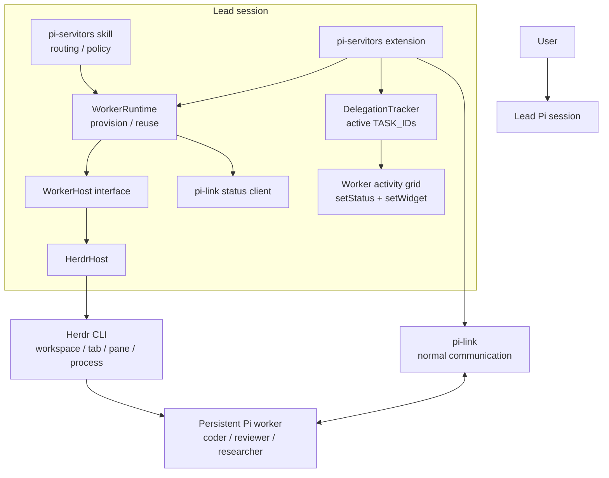
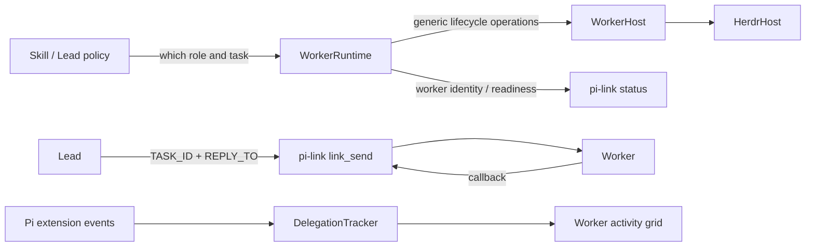
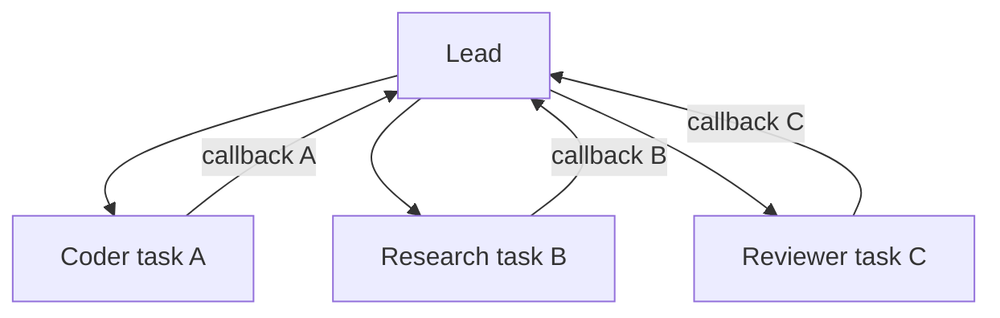

# Architecture

`pi-servitors` keeps orchestration policy, worker lifecycle, terminal hosting,
and worker communication separate. The current terminal backend is Herdr, but
the core runtime depends only on the `WorkerHost` interface.

## Components



The backend is lifecycle infrastructure only. Normal Lead-to-worker and
worker-to-Lead communication never uses terminal pane reads or terminal
messaging.

## Delegation lifecycle

```mermaid
sequenceDiagram
    actor User
    participant Lead as Lead LLM
    participant Ext as pi-servitors
    participant Runtime as WorkerRuntime
    participant Host as WorkerHost / HerdrHost
    participant Link as pi-link
    participant Worker as Pi worker
    participant UI as Worker activity grid

    User->>Lead: Engineering task
    Lead->>Ext: team_ensure_role(role)
    Ext->>Runtime: ensureRole(cwd, role)
    Runtime->>Host: find/reuse or create worker slot
    Host-->>Runtime: worker ready
    Runtime-->>Lead: link_target + lead_link_name

    Lead->>Link: link_send(TASK_ID + REPLY_TO + task)
    Link-->>Ext: successful tool_result event
    Ext->>UI: track TASK_ID and mount activity tile
    Lead-->>Lead: End coordination turn

    Link->>Worker: delegated task
    Worker->>Worker: inspect / implement / verify
    Worker->>Link: link_send(REPLY_TO, TASK_ID + result)
    Link->>Lead: trigger-turn callback starts a fresh Lead turn
    Lead->>Ext: Pi context event exposes callback TASK_ID
    Ext->>UI: complete TASK_ID and remove/update tile

    Lead->>Lead: inspect diff / focused verification
    Lead-->>User: accepted final result
```

There is no **LLM orchestration polling** in the wait phase. The UI timer reads
pi-link `/status` locally for display-only telemetry and does not create model
turns or call `team_runtime_status` / `link_list`.

## Responsibility boundaries



- **Skill / Lead** owns routing, architecture, arbitration, and final acceptance.
- **WorkerRuntime** owns deterministic provisioning, reuse, identity, profiles,
  and dependency checks.
- **WorkerHost** owns terminal/session/slot/process mechanics only.
- **pi-link** is the only normal communication transport.
- **DelegationTracker** owns only active task identities and timestamps.
- **Worker activity grid** reads live worker telemetry from pi-link `/status` using
  local extension polling. This never invokes the Lead model and never controls
  worker execution.

## Concurrency model

The tracker is task-based rather than role-based. Multiple independent
`TASK_ID`s can be active at once and are rendered together. Today the runtime
provisions one deterministic worker per role in a host scope, so practical
parallelism is primarily across different roles. The UI and delegation protocol
do not assume a single active task and therefore do not block a future extension
to multiple instances of the same role.



Each callback carries its own `TASK_ID`, so completions can arrive in any order.
